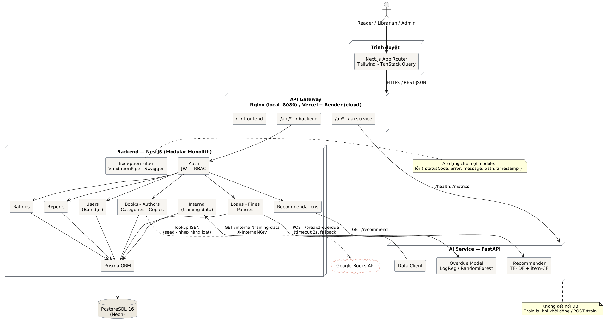
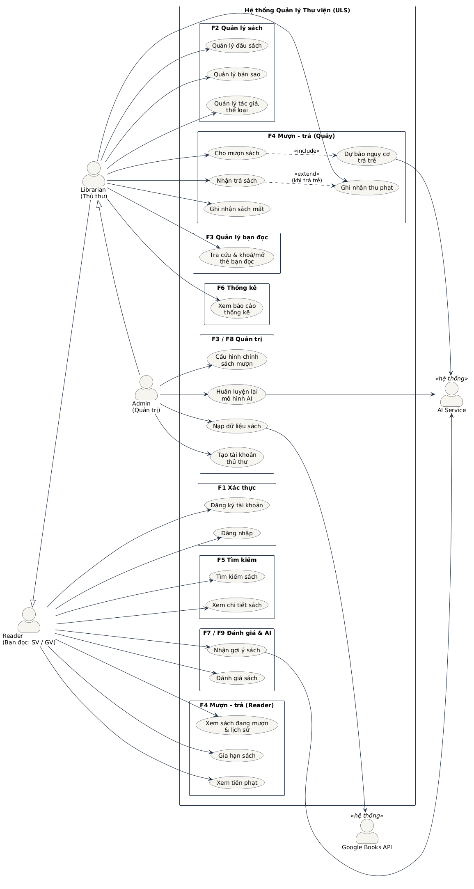
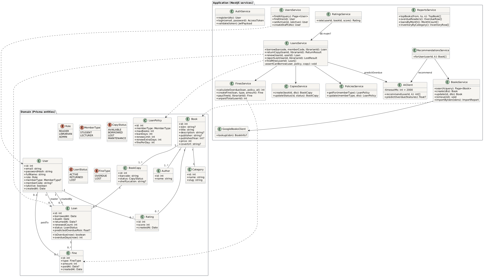
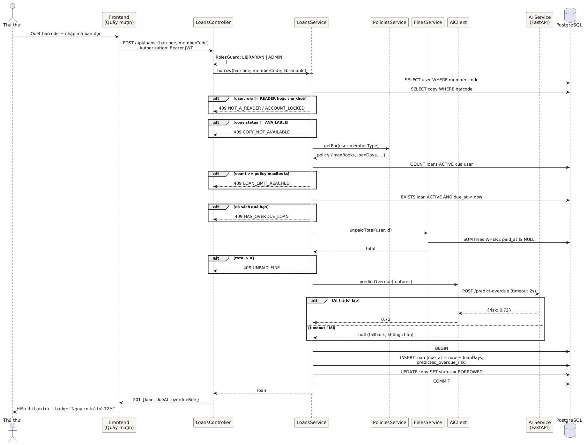
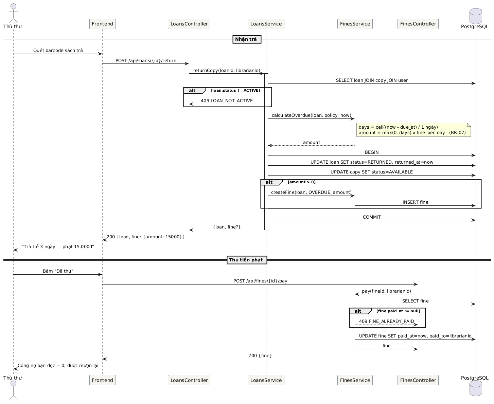
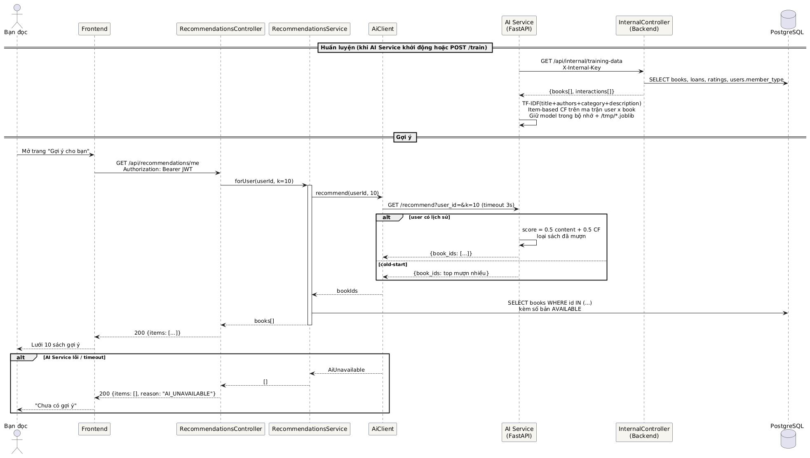
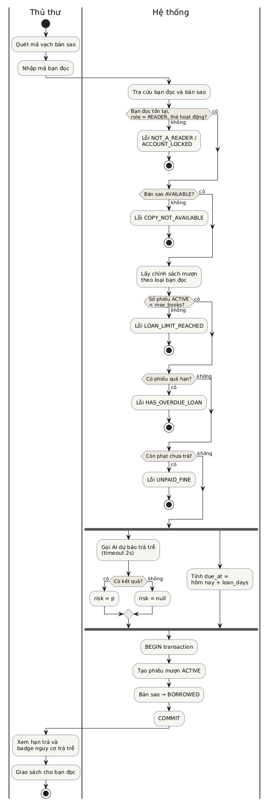
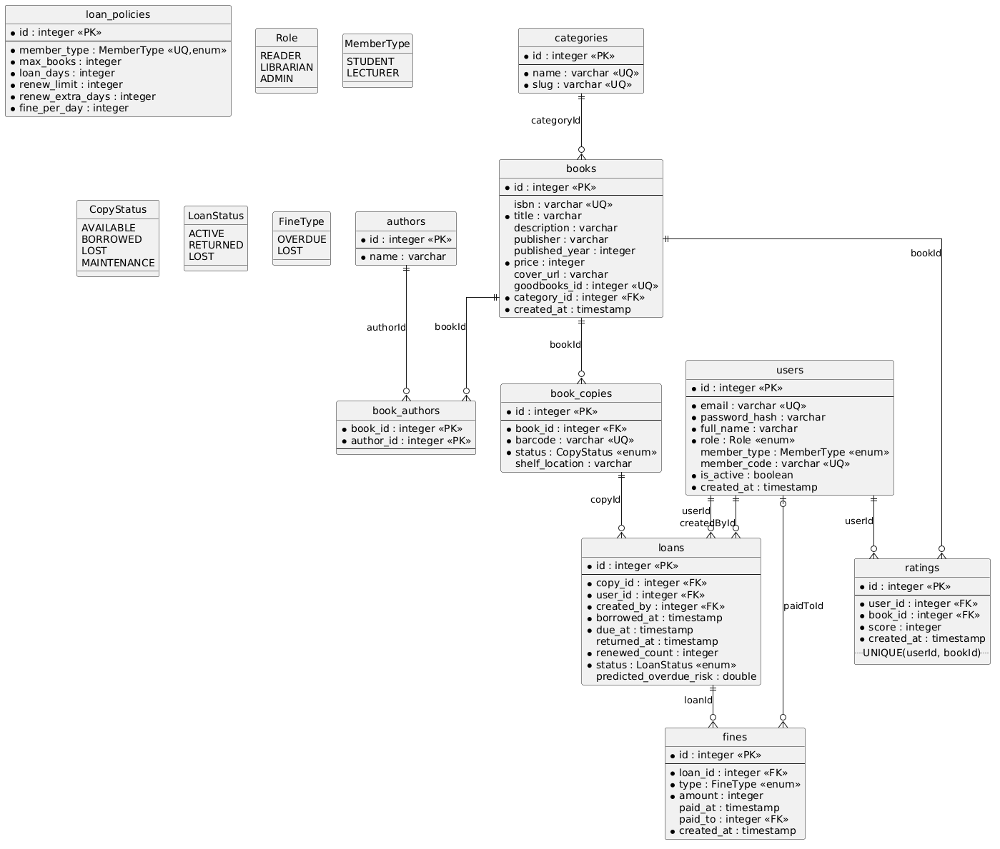

# TÀI LIỆU THIẾT KẾ HỆ THỐNG (SDD)

## Hệ thống Quản lý Thư viện Trường Đại học — University Library System (ULS)

| | |
|---|---|
| Phiên bản | 1.0 |
| Ngày | 23/09/2026 |
| Bài thực hành | LAB 02 — Thiết kế Kiến trúc Hệ thống & Mô hình hóa UML |
| Môn học | Công nghệ Phần mềm — Khoa CNTT, Trường ĐH Xây dựng Miền Trung |
| Giảng viên hướng dẫn | TS. Lê Tỷ Khánh |
| Đề tài | Đề tài 8 — Phần mềm Quản lý Thư viện Trường Đại học |
| Nhóm thực hiện | Trần Đình Khôi — 23Q74802012006 (Nhóm trưởng); [Họ tên SV 2] — [MSSV 2] |
| Tài liệu liên quan | SRS v1.0 (`docs/srs/SRS.md`), Prisma schema (`backend/prisma/schema.prisma`) |

### Lịch sử phiên bản

| Phiên bản | Ngày | Nội dung |
|---|---|---|
| 1.0 | 23/09/2026 | Kiến trúc, bộ UML (Use Case, Class, 3 Sequence, Activity), ERD 3NF + DDL, đặc tả API v1 |

**Nguyên tắc của tài liệu:** mọi sơ đồ là mã nguồn PlantUML trong `docs/uml/`; ERD được **sinh tự động** từ `schema.prisma` (`docs/tools/prisma_to_erd.py`); DDL là file migration thật của Prisma. Sửa code → chạy lại script → tài liệu khớp code.

---

# 1. GIỚI THIỆU

## 1.1. Mục đích

Tài liệu mô tả kiến trúc và thiết kế chi tiết của ULS, làm cầu nối giữa yêu cầu (SRS) và mã nguồn (LAB 3). Người đọc: nhóm phát triển, giảng viên đánh giá.

## 1.2. Phạm vi

Bao gồm: kiến trúc tổng thể và lựa chọn công nghệ; mô hình UML (Use Case, Class, Sequence, Activity); thiết kế cơ sở dữ liệu (ERD chuẩn 3NF, DDL); đặc tả REST API giữa Frontend–Backend và Backend–AI Service; thiết kế xử lý lỗi và bảo mật.

## 1.3. Truy vết yêu cầu

| Thành phần thiết kế | Đáp ứng yêu cầu SRS |
|---|---|
| Kiến trúc 3 dịch vụ + gateway | NFR-PORT-01, NFR-AVAIL-03, NFR-MAINT-01 |
| Module Loans/Fines/Policies | FR-LOAN-01…08, FR-FINE-01/02, FR-POLICY-01/02, BR-01…BR-10 |
| Module Books/Copies/Authors/Categories | FR-BOOK-01…05, FR-COPY-01…03, FR-SEARCH-01…04 |
| Module Users/Auth | FR-AUTH-01…05, FR-USER-01…05, NFR-SEC-01…08 |
| Module Reports, Ratings | FR-REPORT-01…05, FR-RATE-01/02 |
| AI Service + Recommendations | FR-AI-01…07 |
| Global exception filter | FR-LOAN-08, checklist "Exception Handling" |

---

# 2. KIẾN TRÚC HỆ THỐNG

## 2.1. Tổng quan

ULS dùng kiến trúc **Modular Monolith cho Backend + AI Service tách riêng**, giao tiếp REST/JSON. Lựa chọn này thay vì microservices đầy đủ vì: nghiệp vụ thư viện gắn kết chặt (mượn ↔ bản sao ↔ phạt cần transaction chung), nhóm 1–2 người, hạ tầng miễn phí. Phần AI tách riêng vì khác ngôn ngữ (Python/scikit-learn), có chu kỳ huấn luyện riêng và được phép lỗi mà không ảnh hưởng nghiệp vụ.



| Thành phần | Vai trò | Công nghệ | Triển khai |
|---|---|---|---|
| **API Gateway** | Một cổng vào duy nhất; định tuyến `/` → frontend, `/api/*` → backend, `/ai/*` → AI service | Nginx (cục bộ, cổng 8080) | Trên cloud: Vercel + Render đóng vai trò gateway |
| **Frontend** | Giao diện cho 3 vai trò, gọi Backend qua REST | Next.js 15 App Router, TypeScript, TailwindCSS, TanStack Query, Axios | Vercel |
| **Backend API** | Nguồn sự thật duy nhất; toàn bộ quy tắc nghiệp vụ; xác thực/phân quyền; Swagger | NestJS 10, Prisma 6, Passport-JWT, class-validator | Render |
| **AI Service** | Gợi ý sách, dự báo trả trễ; lấy dữ liệu huấn luyện từ Backend | FastAPI, scikit-learn, pandas | Render |
| **Database** | Lưu trữ quan hệ, 10 bảng, 3NF | PostgreSQL 16 | Neon |
| **Tích hợp ngoài** | Thông tin sách theo ISBN (mô tả, NXB, thể loại, bìa) | Google Books API | — |

## 2.2. Kiến trúc phân tầng Backend

Mỗi module NestJS tuân theo **Controller → Service → Repository (Prisma)**:

| Tầng | Trách nhiệm | Không được làm |
|---|---|---|
| Controller | Nhận HTTP, validate DTO, kiểm tra JWT/role (Guard), gọi Service, trả DTO | Chứa logic nghiệp vụ, truy vấn DB |
| Service | Toàn bộ quy tắc nghiệp vụ (BR-01…BR-12), transaction, gọi AI/Google Books qua client | Biết về HTTP (request/response) |
| Repository | Truy vấn qua Prisma Client; mỗi Service dùng `PrismaService` | Chứa quy tắc nghiệp vụ |

Thành phần cắt ngang (cross-cutting): `ValidationPipe` (whitelist, forbidNonWhitelisted), `JwtAuthGuard` + `RolesGuard`, `HttpExceptionFilter` (format lỗi thống nhất), Swagger (`/api/docs`), `ConfigModule` (biến môi trường).

## 2.3. Danh sách module Backend

| Module | Đường dẫn | Chức năng SRS |
|---|---|---|
| `auth` | `/api/auth` | F1 |
| `users` | `/api/users` | F3 |
| `books`, `authors`, `categories`, `copies` | `/api/books`, `/api/authors`, `/api/categories`, `/api/copies` | F2, F5 |
| `loans` | `/api/loans` | F4 |
| `fines` | `/api/fines` | F4 |
| `policies` | `/api/policies` | F8 |
| `ratings` | `/api/books/:id/ratings` | F7 |
| `reports` | `/api/reports` | F6 |
| `recommendations` | `/api/recommendations` | F9 |
| `internal` | `/api/internal` | Cấp dữ liệu huấn luyện cho AI |
| `health` | `/api/health` | Giám sát |

## 2.4. Giao tiếp giữa các dịch vụ

| Từ → Đến | Giao thức | Bảo vệ | Timeout / Fallback |
|---|---|---|---|
| Frontend → Backend | REST/JSON, HTTPS | Bearer JWT, CORS whitelist | — |
| Backend → AI Service | REST/JSON nội bộ | Mạng nội bộ | `predict-overdue` 2 s → `risk = null`; `recommend` 3 s → danh sách rỗng |
| AI Service → Backend | REST/JSON | Header `X-Internal-Key` | Không có dữ liệu → giữ model cũ |
| Backend → Google Books | HTTPS | API key | Không tìm thấy → bỏ qua ISBN đó, báo cáo lại |
| Backend → PostgreSQL | Prisma | Chuỗi kết nối trong biến môi trường | Transaction cho mượn/trả/phạt |

---

# 3. MÔ HÌNH UML

## 3.1. Use Case tổng quan

Ba actor chính với quyền lồng nhau (Admin ⊃ Librarian ⊃ Reader), hai actor phụ là AI Service và Google Books API. Chi tiết mô tả actor và use case ở SRS mục 2.3.



## 3.2. Class Diagram

Sơ đồ lớp gồm hai gói: **Domain** (entity ánh xạ 1-1 với Prisma schema, có phương thức dẫn xuất `isOverdue`, `overdueDays`) và **Application** (các Service của NestJS và hai client ra ngoài `AiClient`, `GoogleBooksClient`). `LoansService` là lớp trung tâm của nghiệp vụ: phụ thuộc `PoliciesService` (lấy chính sách), `FinesService` (tính/tạo phạt), `CopiesService` (đổi trạng thái bản sao) và `AiClient` (dự báo).



## 3.3. Sequence Diagram

### 3.3.1. Cho mượn sách tại quầy kèm dự báo trả trễ (US07, US19)

Luồng phức tạp nhất của hệ thống: 5 điều kiện chặn (BR-01…BR-05), gọi AI có timeout, và transaction gồm tạo phiếu + đổi trạng thái bản sao.



### 3.3.2. Nhận trả sách, tính phạt, thu tiền (US08, US12)



### 3.3.3. Gợi ý sách cá nhân hoá (US18)

Gồm hai pha: huấn luyện (AI Service kéo dữ liệu từ Backend) và phục vụ gợi ý (Backend gọi AI, làm giàu kết quả bằng dữ liệu sách thật, fallback khi AI lỗi).



## 3.4. Activity Diagram — quy trình cho mượn



---

# 4. THIẾT KẾ CƠ SỞ DỮ LIỆU

## 4.1. ERD (sinh từ Prisma schema)



## 4.2. Mô tả bảng

| Bảng | Mục đích | Khoá chính | Khoá ngoại | Ràng buộc |
|---|---|---|---|---|
| `users` | Mọi tài khoản: bạn đọc, thủ thư, admin | `id` | — | `email` UNIQUE, `member_code` UNIQUE, `role` enum, `member_type` enum (chỉ READER có) |
| `loan_policies` | Chính sách mượn theo loại bạn đọc (BR-10) | `id` | — | `member_type` UNIQUE |
| `authors` | Tác giả | `id` | — | — |
| `categories` | Thể loại | `id` | — | `name`, `slug` UNIQUE |
| `books` | Đầu sách | `id` | `category_id → categories` | `isbn` UNIQUE, `goodbooks_id` UNIQUE, `price` cho phạt mất |
| `book_authors` | Quan hệ **n-n** sách – tác giả | (`book_id`, `author_id`) | cả hai, ON DELETE CASCADE | — |
| `book_copies` | Bản sao vật lý | `id` | `book_id → books` | `barcode` UNIQUE, `status` enum |
| `loans` | Phiếu mượn | `id` | `copy_id`, `user_id`, `created_by → users` | `status` enum; index (`user_id`,`status`), (`due_at`) |
| `fines` | Khoản phạt | `id` | `loan_id → loans`, `paid_to → users` (SET NULL) | `type` enum; index (`paid_at`) |
| `ratings` | Đánh giá sách | `id` | `user_id`, `book_id` | UNIQUE (`user_id`,`book_id`), `score` 1–5 |

**Quan hệ:** 1-n: categories–books, books–book_copies, book_copies–loans, users–loans (2 vai: reader, created_by), loans–fines, users–ratings, books–ratings. n-n: books–authors qua `book_authors`.

## 4.3. Chuẩn hoá 3NF

- **1NF:** mọi cột nguyên tử; danh sách tác giả không lưu chuỗi "A, B" mà tách bảng `book_authors`.
- **2NF:** bảng có khoá phức `book_authors` không có cột phụ thuộc một phần khoá.
- **3NF:** không có phụ thuộc bắc cầu — thông tin thể loại tách `categories`; chính sách mượn tách `loan_policies` thay vì lặp trong `users`; tiền phạt tách `fines` thay vì cột trong `loans` (một phiếu có thể vừa phạt trễ vừa phạt mất).
- **Dẫn xuất không lưu:** trạng thái "quá hạn" tính từ `due_at`, `returned_at` (BR-09); số bản còn tính từ `book_copies.status`.

## 4.4. DDL minh hoạ

Toàn bộ DDL là file migration Prisma `docs/erd/ddl.sql` (10 bảng, 5 enum, 9 unique index, 11 foreign key). Trích bảng trung tâm:

```sql
CREATE TYPE "LoanStatus" AS ENUM ('ACTIVE', 'RETURNED', 'LOST');
CREATE TYPE "FineType"   AS ENUM ('OVERDUE', 'LOST');

CREATE TABLE "loans" (
    "id"                     SERIAL NOT NULL,
    "copy_id"                INTEGER NOT NULL,
    "user_id"                INTEGER NOT NULL,
    "created_by"             INTEGER NOT NULL,
    "borrowed_at"            TIMESTAMP(3) NOT NULL DEFAULT CURRENT_TIMESTAMP,
    "due_at"                 TIMESTAMP(3) NOT NULL,
    "returned_at"            TIMESTAMP(3),
    "renewed_count"          INTEGER NOT NULL DEFAULT 0,
    "status"                 "LoanStatus" NOT NULL DEFAULT 'ACTIVE',
    "predicted_overdue_risk" DOUBLE PRECISION,
    CONSTRAINT "loans_pkey" PRIMARY KEY ("id")
);
CREATE INDEX "loans_user_id_status_idx" ON "loans"("user_id", "status");
CREATE INDEX "loans_due_at_idx" ON "loans"("due_at");
ALTER TABLE "loans" ADD CONSTRAINT "loans_copy_id_fkey"
  FOREIGN KEY ("copy_id") REFERENCES "book_copies"("id") ON DELETE RESTRICT ON UPDATE CASCADE;
ALTER TABLE "loans" ADD CONSTRAINT "loans_user_id_fkey"
  FOREIGN KEY ("user_id") REFERENCES "users"("id") ON DELETE RESTRICT ON UPDATE CASCADE;

CREATE TABLE "fines" (
    "id"         SERIAL NOT NULL,
    "loan_id"    INTEGER NOT NULL,
    "type"       "FineType" NOT NULL,
    "amount"     INTEGER NOT NULL,
    "paid_at"    TIMESTAMP(3),
    "paid_to"    INTEGER,
    "created_at" TIMESTAMP(3) NOT NULL DEFAULT CURRENT_TIMESTAMP,
    CONSTRAINT "fines_pkey" PRIMARY KEY ("id")
);

CREATE TABLE "book_authors" (
    "book_id"   INTEGER NOT NULL,
    "author_id" INTEGER NOT NULL,
    CONSTRAINT "book_authors_pkey" PRIMARY KEY ("book_id","author_id")
);
```

---

# 5. ĐẶC TẢ API

## 5.1. Quy ước chung

- Base URL: `/api` (cục bộ `http://localhost:8080/api`). Swagger UI: `/api/docs`, OpenAPI JSON: `/api/docs-json`.
- Định dạng: JSON, UTF-8. Ngày giờ ISO 8601 (UTC). Tiền: số nguyên VND.
- Xác thực: `Authorization: Bearer <JWT>`; JWT hạn 24 h, payload `{sub, role, memberType}`.
- Phân trang: `?page=1&limit=20` (limit ≤ 100) → `{items, total, page, limit}`.
- Vai trò trong bảng: **Pub** = không cần đăng nhập, **R** = Reader, **L** = Librarian, **A** = Admin (A luôn có quyền của L).

**Mã phản hồi chung:**

| Mã | Ý nghĩa |
|---|---|
| 200 / 201 | Thành công / tạo mới |
| 400 | Dữ liệu vào không hợp lệ (`error: "Bad Request"`, `message` là mảng lỗi từng trường) |
| 401 | Thiếu / sai / hết hạn JWT |
| 403 | Đúng JWT nhưng sai vai trò, hoặc truy cập dữ liệu người khác |
| 404 | Không tìm thấy tài nguyên |
| 409 | Vi phạm quy tắc nghiệp vụ hoặc trùng dữ liệu — `error` là mã nghiệp vụ (bảng 5.10) |
| 500 | Lỗi hệ thống |

**Format lỗi thống nhất (global exception filter):**

```json
{
  "statusCode": 409,
  "error": "UNPAID_FINE",
  "message": "Bạn đọc còn 15.000đ phạt chưa thanh toán",
  "path": "/api/loans",
  "timestamp": "2026-10-01T08:30:00.000Z"
}
```

## 5.2. Auth — `/api/auth`

| Method | URL | Vai trò | Request body | Response |
|---|---|---|---|---|
| POST | `/auth/register` | Pub | `{email, password (≥8), fullName, memberType: STUDENT\|LECTURER, memberCode}` | 201 `{id, email, fullName, role: READER, memberType, memberCode}` · 400 · 409 `EMAIL_EXISTS` / `MEMBER_CODE_EXISTS` |
| POST | `/auth/login` | Pub | `{email, password}` | 200 `{accessToken, user}` · 400 · 401 `INVALID_CREDENTIALS` · 403 `ACCOUNT_LOCKED` |
| GET | `/auth/me` | R/L/A | — | 200 `{id, email, fullName, role, memberType, memberCode, isActive}` · 401 |

## 5.3. Users — `/api/users` (quản lý bạn đọc)

| Method | URL | Vai trò | Request | Response |
|---|---|---|---|---|
| GET | `/users?q=&role=&isActive=&page=&limit=` | L | query | 200 `{items: [User], total, page, limit}` · 403 |
| GET | `/users/:id` | L | — | 200 `{...User, activeLoans, unpaidFines}` · 404 |
| GET | `/users/:id/loans?status=&page=` | L | query | 200 `{items: [Loan], total}` · 404 |
| PATCH | `/users/:id` | L | `{isActive?, memberType?, fullName?}` | 200 User · 400 · 404 |
| POST | `/users` | A | `{email, password, fullName, role: LIBRARIAN\|ADMIN}` | 201 User · 400 · 403 · 409 `EMAIL_EXISTS` |

## 5.4. Books, Authors, Categories, Copies

| Method | URL | Vai trò | Request | Response |
|---|---|---|---|---|
| GET | `/books?q=&categoryId=&authorId=&available=&page=&limit=` | Pub | query | 200 `{items: [BookSummary], total, page, limit}` |
| GET | `/books/:id` | Pub | — | 200 `{...Book, authors[], category, copiesTotal, copiesAvailable, ratingAvg, ratingCount}` · 404 |
| POST | `/books` | L | `{title, isbn?, description?, publisher?, publishedYear?, price, coverUrl?, categoryId, authorIds[]}` | 201 Book · 400 · 409 `ISBN_EXISTS` |
| PATCH | `/books/:id` | L | các trường trên (tuỳ chọn) | 200 Book · 400 · 404 · 409 |
| DELETE | `/books/:id` | L | — | 204 · 404 · 409 `BOOK_HAS_ACTIVE_LOANS` |
| POST | `/books/import` | A | `{isbns: string[] (≤100)}` | 200 `{created: [Book], skipped: [{isbn, reason: EXISTS\|NOT_FOUND}]}` · 400 |
| GET | `/books/:id/copies` | L | — | 200 `[BookCopy]` · 404 |
| POST | `/books/:id/copies` | L | `{barcode, shelfLocation?}` | 201 BookCopy · 400 · 404 · 409 `BARCODE_EXISTS` |
| PATCH | `/copies/:id` | L | `{status?, shelfLocation?}` | 200 BookCopy · 400 · 404 · 409 `COPY_HAS_ACTIVE_LOAN` |
| GET | `/authors?q=&page=` | Pub | query | 200 `{items, total}` |
| POST / PATCH / DELETE | `/authors`, `/authors/:id` | L | `{name}` | 201 / 200 / 204 · 400 · 404 |
| GET | `/categories` | Pub | — | 200 `[Category]` |
| POST / PATCH / DELETE | `/categories`, `/categories/:id` | L | `{name, slug?}` | 201 / 200 / 204 · 400 · 404 · 409 `CATEGORY_EXISTS` / `CATEGORY_IN_USE` |

## 5.5. Loans — `/api/loans`

| Method | URL | Vai trò | Request | Response |
|---|---|---|---|---|
| POST | `/loans` | L | `{barcode, memberCode}` | 201 `{loan: Loan, overdueRisk: number\|null}` · 400 · 404 `USER_NOT_FOUND` / `COPY_NOT_FOUND` · 409 `NOT_A_READER`, `ACCOUNT_LOCKED`, `COPY_NOT_AVAILABLE`, `LOAN_LIMIT_REACHED`, `HAS_OVERDUE_LOAN`, `UNPAID_FINE` |
| POST | `/loans/:id/return` | L | — | 200 `{loan, fine: Fine\|null, overdueDays}` · 404 · 409 `LOAN_NOT_ACTIVE` |
| POST | `/loans/:id/report-lost` | L | — | 200 `{loan, fine}` · 404 · 409 `LOAN_NOT_ACTIVE` |
| POST | `/loans/:id/renew` | R | — | 200 Loan · 403 (phiếu người khác) · 404 · 409 `LOAN_NOT_ACTIVE`, `RENEW_LIMIT_REACHED`, `LOAN_OVERDUE_CANNOT_RENEW`, `UNPAID_FINE` |
| GET | `/loans/me?status=&page=` | R | query | 200 `{items: [LoanWithBook], total}` |
| GET | `/loans?status=&overdue=true&userId=&page=` | L | query | 200 `{items: [LoanWithBookUser], total}` |
| GET | `/loans/:id` | L | — | 200 Loan · 404 |

Đối tượng `Loan`: `{id, copy: {id, barcode, book: {id, title, coverUrl}}, user: {id, fullName, memberCode}, borrowedAt, dueAt, returnedAt, renewedCount, status, predictedOverdueRisk, isOverdue, overdueDays}`.

## 5.6. Fines — `/api/fines`

| Method | URL | Vai trò | Request | Response |
|---|---|---|---|---|
| GET | `/fines/me` | R | — | 200 `{items: [Fine], unpaidTotal}` |
| GET | `/fines?paid=false&userId=&page=` | L | query | 200 `{items: [FineWithLoanUser], total}` |
| POST | `/fines/:id/pay` | L | — | 200 Fine · 404 · 409 `FINE_ALREADY_PAID` |

`Fine`: `{id, loanId, type: OVERDUE\|LOST, amount, paidAt, paidTo, createdAt, loan: {book: {title}, dueAt, returnedAt}}`.

## 5.7. Policies, Ratings, Reports

| Method | URL | Vai trò | Request | Response |
|---|---|---|---|---|
| GET | `/policies` | Pub | — | 200 `[{memberType, maxBooks, loanDays, renewLimit, renewExtraDays, finePerDay}]` |
| PATCH | `/policies/:memberType` | A | `{maxBooks?, loanDays?, renewLimit?, renewExtraDays?, finePerDay?}` (nguyên dương) | 200 Policy · 400 · 403 · 404 |
| POST | `/books/:id/ratings` | R | `{score: 1..5}` | 200 `{id, score}` (tạo hoặc ghi đè) · 400 · 403 `NOT_BORROWED` · 404 |
| GET | `/books/:id/ratings/summary` | Pub | — | 200 `{avg, count}` |
| GET | `/reports/top-books?from=&to=&limit=10` | L | query | 200 `[{book, loanCount}]` |
| GET | `/reports/overdue` | L | — | 200 `[{user, loan, overdueDays, estimatedFine}]` |
| GET | `/reports/loans-by-month?months=12` | L | query | 200 `[{month: "2026-09", count}]` |
| GET | `/reports/inventory` | L | — | 200 `[{category, total, available, borrowed, lost, maintenance}]` |

## 5.8. Recommendations & Internal

| Method | URL | Vai trò | Request | Response |
|---|---|---|---|---|
| GET | `/recommendations/me?k=10` | R | query | 200 `{items: [BookSummary], source: MODEL\|POPULAR\|NONE, reason?}` |
| POST | `/recommendations/train` | A | — | 202 `{status: "started"}` · 503 `AI_UNAVAILABLE` |
| GET | `/internal/training-data` | AI (header `X-Internal-Key`) | — | 200 `{books: [{id, title, authors, category, description}], interactions: [{userId, bookId, type: LOAN\|RATING, score?, borrowedAt?, dueAt?, returnedAt?}], users: [{id, memberType}]}` · 401 |
| GET | `/health` | Pub | — | 200 `{status, service, database, timestamp}` |

## 5.9. AI Service (nội bộ, cổng 8000, qua gateway `/ai`)

| Method | URL | Request | Response |
|---|---|---|---|
| GET | `/health` | — | 200 `{status, service, models: {recommender, overdue}}` |
| GET | `/recommend?user_id=&k=10` | query | 200 `{user_id, book_ids: [int], source: "model"\|"popular"}` · 503 model chưa sẵn sàng |
| POST | `/predict-overdue` | `{member_type, prior_loans, prior_overdue, active_loans, category_id, loan_days, month}` | 200 `{risk: 0.0–1.0, model: "rf"\|"logreg"}` · 503 |
| POST | `/train` | — | 202 `{status: "training"}` |
| GET | `/metrics` | — | 200 `{recommender: {precision_at_5, recall_at_5, trained_at}, overdue: {accuracy, precision, recall, f1, roc_auc, trained_at}}` |

## 5.10. Bảng mã lỗi nghiệp vụ

| Mã (`error`) | HTTP | Khi nào | Quy tắc |
|---|---|---|---|
| `EMAIL_EXISTS`, `MEMBER_CODE_EXISTS` | 409 | Đăng ký/tạo user trùng | FR-AUTH-01 |
| `INVALID_CREDENTIALS` | 401 | Sai email/mật khẩu | FR-AUTH-02 |
| `ACCOUNT_LOCKED` | 403 / 409 | Đăng nhập hoặc mượn với thẻ bị khoá | FR-AUTH-05, BR-05 |
| `NOT_A_READER` | 409 | Cho mượn với tài khoản không phải READER | BR-01 |
| `COPY_NOT_AVAILABLE` | 409 | Bản sao không AVAILABLE | BR-05 |
| `LOAN_LIMIT_REACHED` | 409 | Đủ số cuốn theo chính sách | BR-02 |
| `HAS_OVERDUE_LOAN` | 409 | Đang có phiếu quá hạn | BR-03 |
| `UNPAID_FINE` | 409 | Còn phạt chưa trả (mượn hoặc gia hạn) | BR-04, BR-06 |
| `LOAN_NOT_ACTIVE` | 409 | Trả/gia hạn/báo mất phiếu đã đóng | FR-LOAN-03 |
| `RENEW_LIMIT_REACHED` | 409 | Hết lượt gia hạn | BR-06 |
| `LOAN_OVERDUE_CANNOT_RENEW` | 409 | Gia hạn khi đã quá hạn | BR-06 |
| `FINE_ALREADY_PAID` | 409 | Thu lại khoản đã thu | FR-FINE-02 |
| `NOT_BORROWED` | 403 | Chấm sao sách chưa từng mượn | BR-11 |
| `ISBN_EXISTS`, `BARCODE_EXISTS`, `CATEGORY_EXISTS` | 409 | Trùng khoá duy nhất | FR-BOOK-01, FR-COPY-01 |
| `BOOK_HAS_ACTIVE_LOANS`, `COPY_HAS_ACTIVE_LOAN`, `CATEGORY_IN_USE` | 409 | Xoá/đổi trạng thái khi còn ràng buộc | BR-12, FR-COPY-02 |
| `AI_UNAVAILABLE` | 503 (train) / fallback | AI Service không phản hồi | NFR-AVAIL-03 |

---

# 6. THIẾT KẾ BẢO MẬT VÀ XỬ LÝ LỖI

| Mối đe doạ | Biện pháp | Yêu cầu |
|---|---|---|
| Lộ mật khẩu | bcrypt cost 10; không bao giờ trả `passwordHash` (DTO response tách riêng) | NFR-SEC-01 |
| Giả mạo token | JWT HS256, secret từ biến môi trường, hạn 24 h; `JwtAuthGuard` toàn cục, route công khai đánh dấu `@Public()` | NFR-SEC-02 |
| Leo thang quyền | `RolesGuard` đọc `@Roles()`; Reader chỉ truy cập `/me`; service kiểm tra `loan.userId === req.user.id` khi gia hạn | NFR-SEC-03 |
| Dữ liệu vào độc hại | `ValidationPipe` whitelist + forbidNonWhitelisted; Prisma tham số hoá | NFR-SEC-04, 06 |
| Brute-force đăng nhập | `@nestjs/throttler` 10 req/phút cho `/auth/login` | NFR-SEC-05 |
| Gọi trộm endpoint nội bộ | `InternalKeyGuard` so sánh `X-Internal-Key` | NFR-SEC-08 |
| Lỗi không đồng nhất | `HttpExceptionFilter` bắt mọi exception → format mục 5.1; lỗi 500 được log, không lộ stack | FR-LOAN-08 |
| Mất nhất quán dữ liệu | `prisma.$transaction` cho mượn/trả/báo mất/thu phạt | NFR-AVAIL-02 |

---

# 7. QUYẾT ĐỊNH THIẾT KẾ (ADR rút gọn)

| # | Quyết định | Lý do | Hệ quả |
|---|---|---|---|
| 1 | Modular monolith + AI tách riêng thay vì 4–5 microservices | Nghiệp vụ cần transaction chung; nhóm nhỏ; hạ tầng free | Sơ đồ kiến trúc vẫn có gateway, 3 dịch vụ, DB, tích hợp ngoài; dễ tách thêm sau |
| 2 | "Quá hạn" là trạng thái dẫn xuất | Tránh cron và trạng thái lệch | Truy vấn dùng `due_at < now()`; có index `due_at` |
| 3 | Chính sách mượn trong bảng, chụp vào phiếu lúc tạo | Admin đổi qua UI; phiếu cũ không bị ảnh hưởng | `due_at` tính tại thời điểm mượn (BR-10) |
| 4 | AI không chạm DB, lấy dữ liệu qua `/internal/training-data` | Một nơi sở hữu schema; AI thay được | Backend thêm 1 endpoint; AI cần key |
| 5 | Gọi AI có timeout + fallback | Render free cold start ~50 s không được chặn quầy | `overdueRisk` có thể null; UI hiển thị "không có dự báo" |
| 6 | Google Books chỉ ở seed và nhập hàng loạt, không gọi khi tra cứu | Giới hạn 1.000 req/ngày; tra cứu phải < 1 s | Dữ liệu sách lưu cục bộ, có `goodbooks_id`/`isbn` để đối chiếu |
