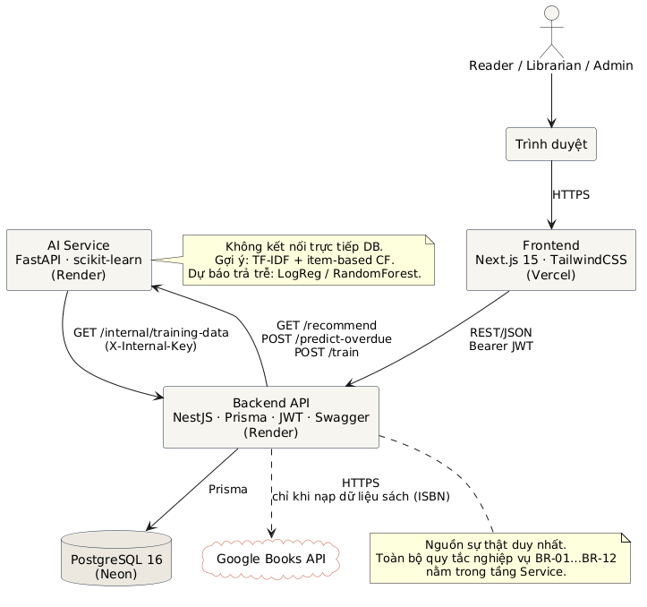
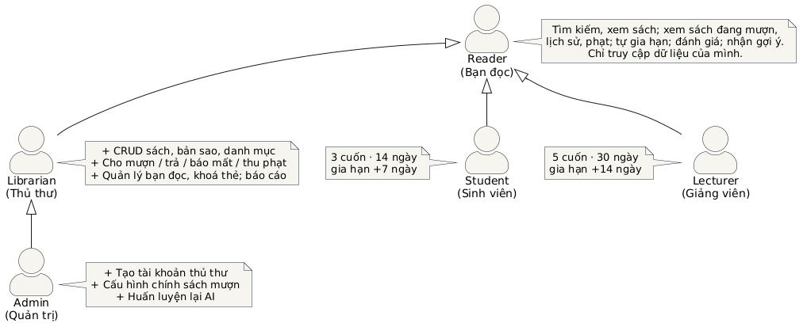

# TÀI LIỆU ĐẶC TẢ YÊU CẦU PHẦN MỀM (SRS)

## Hệ thống Quản lý Thư viện Trường Đại học — University Library System (ULS)

| | |
|---|---|
| Phiên bản | 1.0 |
| Ngày | 22/09/2026 |
| Chuẩn áp dụng | IEEE Std 830-1998 |
| Môn học | Công nghệ Phần mềm — Khoa CNTT, Trường ĐH Xây dựng Miền Trung |
| Giảng viên hướng dẫn | TS. Lê Tỷ Khánh |
| Đề tài | Đề tài 8 — Phần mềm Quản lý Thư viện Trường Đại học |
| Nhóm thực hiện | [Họ tên SV 1] (Nhóm trưởng), [Họ tên SV 2], [Họ tên SV 3], [Họ tên SV 4] |

### Lịch sử phiên bản

| Phiên bản | Ngày | Người sửa | Nội dung |
|---|---|---|---|
| 0.1 | 21/09/2026 | Nhóm | Bản nháp: actor, phạm vi, backlog |
| 1.0 | 22/09/2026 | Nhóm | Hoàn thiện 3 phần chính theo IEEE 830, 20 User Story, NFR đo được |

---

# 1. GIỚI THIỆU

## 1.1. Mục đích

Tài liệu này đặc tả đầy đủ các yêu cầu chức năng và phi chức năng của **Hệ thống Quản lý Thư viện Trường Đại học** (viết tắt: ULS). Tài liệu dùng làm cơ sở thống nhất giữa nhóm phát triển, giảng viên hướng dẫn (đóng vai khách hàng) và người kiểm thử; là đầu vào cho các giai đoạn thiết kế (LAB 2), lập trình (LAB 3) và kiểm thử – triển khai (LAB 4).

Đối tượng đọc: giảng viên hướng dẫn, thành viên nhóm phát triển, người kiểm thử và người đánh giá sản phẩm bài tập lớn.

## 1.2. Phạm vi sản phẩm

ULS là ứng dụng web quản lý nghiệp vụ thư viện của một trường đại học, gồm: quản lý kho sách và bản sao vật lý, quản lý bạn đọc, mượn – trả – gia hạn – phạt, tìm kiếm, thống kê báo cáo, và hai chức năng trí tuệ nhân tạo: **gợi ý sách cá nhân hoá** và **dự báo nguy cơ trả trễ** khi cho mượn.

**Mục tiêu:**

- Số hoá toàn bộ quy trình mượn/trả, thay thế ghi chép thủ công; thao tác cho mượn tại quầy ≤ 30 giây.
- Bạn đọc tự tra cứu, xem tình trạng sách, gia hạn trực tuyến, giảm số lượt đến quầy.
- Tự động tính phạt quá hạn và chặn mượn khi vi phạm, loại bỏ sai sót thủ công.
- Cung cấp số liệu thống kê phục vụ quyết định bổ sung sách.
- Ứng dụng AI để tăng tỉ lệ sách được mượn và giảm tỉ lệ trả trễ.

**Ngoài phạm vi** (xem mục 2.6): đặt trước sách, thanh toán trực tuyến, gửi email/SMS, ứng dụng di động, in thẻ/mã vạch.

## 1.3. Định nghĩa, từ viết tắt

| Thuật ngữ | Ý nghĩa |
|---|---|
| ULS | University Library System — hệ thống này |
| Reader / Bạn đọc | Người dùng có quyền mượn sách: sinh viên (STUDENT) hoặc giảng viên (LECTURER) |
| Librarian / Thủ thư | Nhân viên thư viện, thao tác nghiệp vụ tại quầy |
| Admin / Quản trị | Người quản trị hệ thống, cấu hình chính sách và tài khoản |
| Book / Đầu sách | Một tựa sách (ISBN, tiêu đề, tác giả…) |
| Copy / Bản sao | Một cuốn sách vật lý cụ thể, có mã vạch riêng |
| Loan / Phiếu mượn | Bản ghi một lần mượn một bản sao |
| Fine / Phạt | Khoản tiền phát sinh do trả trễ hoặc làm mất sách |
| Loan Policy / Chính sách mượn | Bộ tham số: số cuốn tối đa, số ngày mượn, số lần gia hạn, mức phạt — theo loại bạn đọc |
| US | User Story |
| AC | Acceptance Criteria — điều kiện nghiệm thu |
| FR / NFR | Functional / Non-functional Requirement |
| BR | Business Rule — quy tắc nghiệp vụ |
| JWT | JSON Web Token — cơ chế xác thực không trạng thái |
| RBAC | Role-Based Access Control — phân quyền theo vai trò |
| API | Application Programming Interface (REST/JSON) |
| SRS | Software Requirements Specification |

## 1.4. Tài liệu tham khảo

1. IEEE Std 830-1998, *IEEE Recommended Practice for Software Requirements Specifications*.
2. TS. Lê Tỷ Khánh, *Hướng dẫn thực hành LAB kèm tài liệu hỗ trợ Bài tập lớn*, môn Công nghệ Phần mềm, 2026.
3. *10 Bài tập nhóm — Kế hoạch Quản lý Dự án*, Đề tài 8, 2026.
4. Bộ dữ liệu goodbooks-10k (CC BY-SA 4.0), https://github.com/zygmuntz/goodbooks-10k.
5. Google Books API, https://developers.google.com/books.
6. Tài liệu NestJS, Next.js, Prisma, FastAPI, scikit-learn (phiên bản hiện hành).

## 1.5. Tổng quan tài liệu

- **Phần 2** mô tả tổng quan sản phẩm: bối cảnh, chức năng chính, người dùng, ràng buộc, giả định.
- **Phần 3** đặc tả chi tiết: giao diện ngoài, từng tính năng hệ thống (FR), yêu cầu phi chức năng (NFR), quy tắc nghiệp vụ (BR).
- **Phụ lục A** là Product Backlog gồm 20 User Story có Acceptance Criteria và Story Point.
- **Phụ lục B** là ma trận truy vết User Story ↔ Yêu cầu chức năng.

---

# 2. MÔ TẢ TỔNG QUAN

## 2.1. Bối cảnh sản phẩm

ULS là hệ thống độc lập, xây dựng mới, không kế thừa hệ thống cũ. Kiến trúc gồm ba dịch vụ:

```
[Trình duyệt] ──HTTPS──▶ Frontend (Next.js)
                              │ REST/JSON
                              ▼
                        Backend API (NestJS) ── JWT, RBAC, Swagger
                         │            │
                         │            └──REST──▶ AI Service (FastAPI, scikit-learn)
                         ▼
                   PostgreSQL 16
                         ▲
        Google Books API ─┘ (chỉ dùng khi nạp dữ liệu sách ban đầu)
```

- **Frontend** chạy trên trình duyệt, gọi Backend qua REST.
- **Backend** là nguồn sự thật duy nhất về dữ liệu, thực thi toàn bộ quy tắc nghiệp vụ, cung cấp dữ liệu huấn luyện cho AI Service.
- **AI Service** tách riêng, không kết nối trực tiếp cơ sở dữ liệu; cung cấp hai năng lực: gợi ý sách và dự báo trả trễ.
- **Google Books API** là tích hợp bên ngoài, chỉ dùng ở bước nạp dữ liệu để lấy mô tả, nhà xuất bản, thể loại theo ISBN.



## 2.2. Chức năng sản phẩm (tóm tắt)

| # | Nhóm chức năng | Mô tả ngắn |
|---|---|---|
| F1 | Xác thực & phân quyền | Đăng ký, đăng nhập, ba vai trò Reader / Librarian / Admin |
| F2 | Quản lý sách | CRUD đầu sách, tác giả, thể loại, bản sao vật lý (mã vạch, trạng thái, vị trí kệ) |
| F3 | Quản lý bạn đọc | Xem hồ sơ, lịch sử mượn, khoá/mở thẻ, tạo tài khoản thủ thư |
| F4 | Mượn – trả | Cho mượn tại quầy, trả, gia hạn, báo mất, tính phạt, ghi nhận thanh toán |
| F5 | Tìm kiếm | Tìm theo tiêu đề / tác giả / thể loại / ISBN, lọc còn sách, phân trang |
| F6 | Thống kê – báo cáo | Sách mượn nhiều, bạn đọc quá hạn, lượt mượn theo tháng, tồn kho theo thể loại |
| F7 | Đánh giá sách | Bạn đọc chấm 1–5 sao sách đã mượn |
| F8 | Cấu hình chính sách | Admin sửa tham số mượn theo loại bạn đọc |
| F9 | AI gợi ý sách | Danh sách sách gợi ý cá nhân hoá cho từng bạn đọc |
| F10 | AI dự báo trả trễ | Xác suất trả trễ hiển thị cho thủ thư lúc cho mượn |

## 2.3. Đặc điểm người dùng (Actor)

### Actor chính

| Actor | Mô tả | Quyền hạn | Đặc điểm |
|---|---|---|---|
| **Reader (Bạn đọc)** | Sinh viên (STUDENT) hoặc giảng viên (LECTURER) của trường | Đăng ký, đăng nhập; tìm kiếm, xem sách; xem sách đang mượn, lịch sử, tiền phạt; tự gia hạn; đánh giá sách; nhận gợi ý | Số lượng lớn (hàng nghìn); dùng trên điện thoại và máy tính; kỹ năng tin học cơ bản |
| **Librarian (Thủ thư)** | Nhân viên thư viện làm việc tại quầy | Toàn bộ quyền Reader (xem) + CRUD sách/bản sao/tác giả/thể loại; cho mượn, nhận trả, báo mất, ghi nhận thanh toán phạt; quản lý bạn đọc; xem báo cáo | 2–5 người; dùng máy tính tại quầy; cần thao tác nhanh, ít bước |
| **Admin (Quản trị)** | Trưởng thư viện / phòng CNTT | Toàn bộ quyền Librarian + tạo tài khoản Librarian/Admin; cấu hình chính sách mượn | 1–2 người; ít thao tác nhưng có quyền cao |

### Actor phụ (hệ thống ngoài)

| Actor | Vai trò |
|---|---|
| **AI Service** | Nhận yêu cầu từ Backend, trả về danh sách gợi ý / xác suất trả trễ; lấy dữ liệu huấn luyện từ Backend |
| **Google Books API** | Cung cấp mô tả, nhà xuất bản, thể loại theo ISBN khi nạp dữ liệu ban đầu |




## 2.4. Ràng buộc

- **Công nghệ:** Frontend Next.js 15 + TypeScript + TailwindCSS; Backend NestJS 10 + Prisma + PostgreSQL 16; AI Service FastAPI + scikit-learn. Đóng gói Docker, CI/CD GitHub Actions.
- **Triển khai:** hạ tầng miễn phí (Vercel, Render free, Neon free) — không có thẻ thanh toán; dịch vụ backend có thể "ngủ" sau 15 phút không dùng.
- **Thời gian:** 8 tuần, theo 4 LAB của môn học.
- **Nhân lực:** nhóm sinh viên 1–2 người làm chính (báo cáo ghi 4 thành viên).
- **Quy ước mã nguồn:** tên file, hàm, biến bằng tiếng Anh; giao diện và tài liệu tiếng Việt.
- **Pháp lý:** dữ liệu sách mẫu từ goodbooks-10k (CC BY-SA 4.0) phải ghi nguồn.
- **Bảo mật:** mật khẩu băm bằng bcrypt; không lưu mật khẩu thô; token có hạn.

## 2.5. Giả định và phụ thuộc

- Mỗi bản sao sách có một mã vạch duy nhất; thủ thư nhập mã bằng tay hoặc máy quét (máy quét hoạt động như bàn phím).
- Bạn đọc là thành viên của trường, có mã sinh viên/giảng viên; hệ thống không xác minh với hệ thống đào tạo.
- Mức phạt và hạn mượn là tham số giả định (bảng 3.4), Admin thay đổi được.
- Google Books API trả về mô tả cho phần lớn ISBN; sách thiếu mô tả vẫn được quản lý bình thường.
- Dữ liệu mượn/trả lịch sử để huấn luyện AI là dữ liệu **mô phỏng** từ goodbooks-10k, không phải dữ liệu thật của thư viện.
- Người dùng dùng trình duyệt hiện đại (Chrome/Edge/Safari/Firefox 2 phiên bản gần nhất).

## 2.6. Ngoài phạm vi (Out of scope)

- Đặt trước / giữ chỗ sách.
- Thanh toán phạt trực tuyến (chỉ ghi nhận thủ thư đã thu tiền mặt).
- Gửi email / SMS nhắc hạn.
- Ứng dụng di động native.
- In thẻ bạn đọc, in mã vạch.
- Refresh token / đăng nhập nhiều thiết bị có quản lý phiên.
- Tích hợp với hệ thống đào tạo / cổng sinh viên.

---

# 3. YÊU CẦU CỤ THỂ

## 3.1. Yêu cầu giao diện ngoài

### 3.1.1. Giao diện người dùng

- Ứng dụng web responsive, hoạt động từ chiều rộng 360 px (điện thoại) đến 1920 px.
- Ba khu vực giao diện theo vai trò: **Bạn đọc** (tra cứu, sách của tôi, gợi ý), **Thủ thư** (quầy mượn/trả, kho sách, bạn đọc, báo cáo), **Quản trị** (tài khoản, chính sách).
- Mọi thao tác nghiệp vụ chính (cho mượn, trả) hoàn tất trong ≤ 3 lần nhấp.
- Thông báo lỗi bằng tiếng Việt, nêu rõ nguyên nhân (ví dụ: "Bạn đọc còn 15.000đ phạt chưa thanh toán").

### 3.1.2. Giao diện phần cứng

- Không yêu cầu phần cứng đặc thù. Máy quét mã vạch (nếu có) hoạt động ở chế độ giả lập bàn phím.

### 3.1.3. Giao diện phần mềm

| Giao diện | Giao thức | Mô tả |
|---|---|---|
| Frontend ↔ Backend | REST/JSON qua HTTPS, xác thực Bearer JWT | Toàn bộ chức năng; đặc tả OpenAPI 3 sinh từ Swagger |
| Backend ↔ AI Service | REST/JSON nội bộ | `GET /recommend`, `POST /predict-overdue`, `POST /train`, `GET /health` |
| AI Service ↔ Backend | REST/JSON, header `X-Internal-Key` | `GET /internal/training-data` — dữ liệu huấn luyện |
| Backend ↔ PostgreSQL | TCP, Prisma ORM | Lưu trữ |
| Backend (seed) ↔ Google Books API | HTTPS | Lấy mô tả sách theo ISBN, tối đa 1.000 yêu cầu/ngày |

### 3.1.4. Giao diện truyền thông

- HTTPS trên môi trường triển khai; HTTP trong docker-compose cục bộ qua Nginx gateway cổng 80.
- CORS chỉ cho phép origin của Frontend.

## 3.2. Tính năng hệ thống (Functional Requirements)

Quy ước: mỗi FR có mã `FR-<nhóm>-<số>`, mức ưu tiên **Cao / Trung bình / Thấp**.

### 3.2.1. F1 — Xác thực và phân quyền

**Mô tả:** Người dùng đăng ký, đăng nhập và được phân quyền theo vai trò.

| Mã | Yêu cầu | Ưu tiên |
|---|---|---|
| FR-AUTH-01 | Hệ thống cho phép đăng ký tài khoản bạn đọc với: email (duy nhất), mật khẩu (≥ 8 ký tự), họ tên, loại bạn đọc (STUDENT/LECTURER), mã SV/GV (duy nhất). Tài khoản mới luôn có vai trò READER. | Cao |
| FR-AUTH-02 | Hệ thống cho phép đăng nhập bằng email + mật khẩu; thành công trả về JWT có hạn 24 giờ chứa id, vai trò. | Cao |
| FR-AUTH-03 | Mọi API (trừ đăng ký, đăng nhập, tra cứu sách công khai) yêu cầu JWT hợp lệ; API ghi dữ liệu kiểm tra vai trò (RBAC). Truy cập sai quyền trả HTTP 403. | Cao |
| FR-AUTH-04 | Người dùng xem được thông tin tài khoản của mình (`/auth/me`). | Trung bình |
| FR-AUTH-05 | Tài khoản bị khoá (`is_active = false`) không đăng nhập được, trả lỗi `ACCOUNT_LOCKED`. | Cao |

### 3.2.2. F2 — Quản lý sách và bản sao

| Mã | Yêu cầu | Ưu tiên |
|---|---|---|
| FR-BOOK-01 | Thủ thư thêm đầu sách với: ISBN (duy nhất, tuỳ chọn), tiêu đề (bắt buộc), mô tả, nhà xuất bản, năm xuất bản, giá bìa, ảnh bìa, một thể loại, một hoặc nhiều tác giả. | Cao |
| FR-BOOK-02 | Thủ thư sửa thông tin đầu sách. | Cao |
| FR-BOOK-03 | Thủ thư xoá đầu sách chỉ khi không còn bản sao nào đang được mượn; nếu vi phạm trả lỗi `BOOK_HAS_ACTIVE_LOANS`. | Trung bình |
| FR-BOOK-04 | Thủ thư quản lý danh mục tác giả và thể loại (thêm/sửa/xoá); không xoá thể loại đang có sách. | Trung bình |
| FR-COPY-01 | Thủ thư thêm bản sao cho một đầu sách với mã vạch duy nhất và vị trí kệ; bản sao mới có trạng thái AVAILABLE. | Cao |
| FR-COPY-02 | Thủ thư cập nhật trạng thái bản sao trong tập {AVAILABLE, BORROWED, LOST, MAINTENANCE}; không thể đặt AVAILABLE cho bản sao đang có phiếu mượn ACTIVE. | Cao |
| FR-COPY-03 | Hệ thống hiển thị số bản sao còn mượn được (AVAILABLE) của mỗi đầu sách. | Cao |

### 3.2.3. F3 — Quản lý bạn đọc

| Mã | Yêu cầu | Ưu tiên |
|---|---|---|
| FR-USER-01 | Thủ thư xem danh sách bạn đọc, tìm theo tên / email / mã SV-GV, lọc theo vai trò và trạng thái thẻ. | Cao |
| FR-USER-02 | Thủ thư xem hồ sơ bạn đọc: thông tin, sách đang mượn, lịch sử mượn, tiền phạt chưa trả. | Cao |
| FR-USER-03 | Thủ thư khoá / mở thẻ bạn đọc; thẻ bị khoá không được mượn và không đăng nhập. | Cao |
| FR-USER-04 | Thủ thư sửa loại bạn đọc (STUDENT ↔ LECTURER). | Thấp |
| FR-USER-05 | Admin tạo tài khoản có vai trò LIBRARIAN hoặc ADMIN. | Cao |

### 3.2.4. F4 — Mượn, trả, gia hạn, phạt

| Mã | Yêu cầu | Ưu tiên |
|---|---|---|
| FR-LOAN-01 | Thủ thư tạo phiếu mượn bằng **mã vạch bản sao + mã bạn đọc**. Hệ thống kiểm tra toàn bộ điều kiện ở BR-01…BR-05; đạt thì tạo phiếu ACTIVE, đặt `due_at = hôm nay + loan_days`, chuyển bản sao sang BORROWED. | Cao |
| FR-LOAN-02 | Khi tạo phiếu mượn, hệ thống gọi AI Service để lấy xác suất trả trễ và trả kèm trong phản hồi; nếu AI không phản hồi trong 2 giây, phiếu mượn vẫn được tạo với `overdueRisk = null`. | Trung bình |
| FR-LOAN-03 | Thủ thư nhận trả sách theo mã vạch: phiếu → RETURNED, `returned_at = now`, bản sao → AVAILABLE; nếu trả trễ, tự tạo khoản phạt OVERDUE theo BR-07. | Cao |
| FR-LOAN-04 | Bạn đọc tự gia hạn phiếu mượn của mình theo BR-06; thành công thì `due_at += renew_extra_days`, `renewed_count += 1`. | Cao |
| FR-LOAN-05 | Bạn đọc xem sách đang mượn (kèm ngày hạn, số ngày còn lại / đã trễ) và lịch sử mượn. | Cao |
| FR-LOAN-06 | Thủ thư ghi nhận báo mất theo BR-08: phiếu → LOST, bản sao → LOST, tạo khoản phạt LOST. | Trung bình |
| FR-LOAN-07 | Thủ thư xem danh sách phiếu mượn, lọc theo trạng thái và "quá hạn". | Cao |
| FR-FINE-01 | Bạn đọc xem các khoản phạt của mình và tổng chưa thanh toán. | Cao |
| FR-FINE-02 | Thủ thư xem danh sách khoản phạt chưa thanh toán và ghi nhận đã thu (`paid_at`, người thu). | Cao |
| FR-LOAN-08 | Mọi lỗi nghiệp vụ trả HTTP 400/409 với mã lỗi rõ ràng: `LOAN_LIMIT_REACHED`, `HAS_OVERDUE_LOAN`, `UNPAID_FINE`, `COPY_NOT_AVAILABLE`, `ACCOUNT_LOCKED`, `RENEW_LIMIT_REACHED`, `LOAN_OVERDUE_CANNOT_RENEW`, `NOT_A_READER`. | Cao |

### 3.2.5. F5 — Tìm kiếm

| Mã | Yêu cầu | Ưu tiên |
|---|---|---|
| FR-SEARCH-01 | Mọi người dùng (kể cả chưa đăng nhập) tìm sách theo từ khoá khớp tiêu đề, tên tác giả hoặc ISBN (không phân biệt hoa thường, dấu). | Cao |
| FR-SEARCH-02 | Lọc kết quả theo thể loại, tác giả, và "chỉ sách còn bản mượn được". | Cao |
| FR-SEARCH-03 | Phân trang: mặc định 20 kết quả/trang, tối đa 100; trả về tổng số kết quả. | Cao |
| FR-SEARCH-04 | Xem chi tiết đầu sách: thông tin, tác giả, số bản còn, điểm đánh giá trung bình, danh sách bản sao (thủ thư). | Cao |

### 3.2.6. F6 — Thống kê, báo cáo

| Mã | Yêu cầu | Ưu tiên |
|---|---|---|
| FR-REPORT-01 | Top N sách được mượn nhiều nhất trong khoảng thời gian chọn. | Cao |
| FR-REPORT-02 | Danh sách bạn đọc đang có sách quá hạn kèm số ngày trễ và tiền phạt ước tính. | Cao |
| FR-REPORT-03 | Số lượt mượn theo tháng trong 12 tháng gần nhất (biểu đồ cột). | Cao |
| FR-REPORT-04 | Tồn kho theo thể loại: tổng bản sao, đang mượn, còn, mất/bảo trì (biểu đồ). | Trung bình |
| FR-REPORT-05 | Chỉ Librarian và Admin truy cập báo cáo. | Cao |

### 3.2.7. F7 — Đánh giá sách

| Mã | Yêu cầu | Ưu tiên |
|---|---|---|
| FR-RATE-01 | Bạn đọc chấm 1–5 sao cho đầu sách **đã từng mượn và trả**; mỗi bạn đọc một điểm/đầu sách, chấm lại thì ghi đè. | Trung bình |
| FR-RATE-02 | Trang chi tiết sách hiển thị điểm trung bình và số lượt đánh giá. | Thấp |

### 3.2.8. F8 — Cấu hình chính sách mượn

| Mã | Yêu cầu | Ưu tiên |
|---|---|---|
| FR-POLICY-01 | Admin xem và sửa chính sách mượn theo loại bạn đọc: `max_books`, `loan_days`, `renew_limit`, `renew_extra_days`, `fine_per_day`. Giá trị phải là số nguyên dương. | Trung bình |
| FR-POLICY-02 | Thay đổi chính sách áp dụng cho phiếu mượn tạo **sau** thời điểm sửa; phiếu đang mượn giữ nguyên hạn. | Trung bình |

### 3.2.9. F9 — AI gợi ý sách

| Mã | Yêu cầu | Ưu tiên |
|---|---|---|
| FR-AI-01 | Bạn đọc xem danh sách 10 sách gợi ý cá nhân hoá, dựa trên lịch sử mượn, đánh giá của bản thân và nội dung sách (mô hình lai: content-based + collaborative filtering). | Cao |
| FR-AI-02 | Bạn đọc chưa có lịch sử nhận gợi ý là các sách được mượn nhiều nhất. | Trung bình |
| FR-AI-03 | Gợi ý loại trừ sách bạn đọc đã mượn; ưu tiên sách còn bản mượn được. | Trung bình |
| FR-AI-04 | Mô hình được huấn luyện lại qua `POST /train` (Admin) hoặc khi AI Service khởi động. | Trung bình |

### 3.2.10. F10 — AI dự báo trả trễ

| Mã | Yêu cầu | Ưu tiên |
|---|---|---|
| FR-AI-05 | Khi thủ thư tạo phiếu mượn, giao diện hiển thị "Nguy cơ trả trễ: X%" với mức màu (thấp < 30%, trung bình 30–60%, cao > 60%). | Cao |
| FR-AI-06 | Dự báo dựa trên: số lần trễ trước đó, tỉ lệ trễ, số sách đang mượn, loại bạn đọc, thể loại sách, số ngày mượn, tháng mượn. | Cao |
| FR-AI-07 | Xác suất dự báo được lưu vào phiếu mượn để sau này đối chiếu độ chính xác thực tế. | Thấp |

## 3.3. Yêu cầu phi chức năng (Non-functional Requirements)

### 3.3.1. Hiệu năng

| Mã | Yêu cầu | Chỉ số đo |
|---|---|---|
| NFR-PERF-01 | Thời gian phản hồi API nghiệp vụ (tạo phiếu mượn, trả, tra cứu) | ≤ 2 giây tại p95 với 1.000 đầu sách, 3.000 bản sao, 2.000 bạn đọc, 20 người dùng đồng thời |
| NFR-PERF-02 | Tìm kiếm sách | ≤ 1 giây tại p95 |
| NFR-PERF-03 | Gợi ý AI | ≤ 3 giây khi model đã nạp; không chặn các chức năng khác |
| NFR-PERF-04 | Tải trang đầu (Frontend) | ≤ 3 giây trên mạng 4G, Lighthouse Performance ≥ 80 |

### 3.3.2. Bảo mật

| Mã | Yêu cầu |
|---|---|
| NFR-SEC-01 | Mật khẩu băm bcrypt (cost ≥ 10); không bao giờ trả mật khẩu/hash qua API. |
| NFR-SEC-02 | JWT ký HS256, hết hạn 24 giờ; khoá bí mật lấy từ biến môi trường, không có trong mã nguồn. |
| NFR-SEC-03 | RBAC trên mọi endpoint ghi dữ liệu; bạn đọc chỉ truy cập dữ liệu của mình (`/loans/me`, `/fines/me`). |
| NFR-SEC-04 | Kiểm tra hợp lệ toàn bộ dữ liệu đầu vào (class-validator); từ chối trường lạ. |
| NFR-SEC-05 | Giới hạn tốc độ đăng nhập: 10 lần/phút/IP. |
| NFR-SEC-06 | Chỉ dùng truy vấn tham số hoá (Prisma) — chống SQL injection; escape đầu ra — chống XSS. |
| NFR-SEC-07 | HTTPS trên môi trường triển khai; CORS whitelist. |
| NFR-SEC-08 | Endpoint nội bộ `/internal/*` yêu cầu khoá `X-Internal-Key`. |

### 3.3.3. Độ tin cậy và khả dụng

| Mã | Yêu cầu |
|---|---|
| NFR-AVAIL-01 | Mục tiêu khả dụng 99% trong giờ làm việc của thư viện (7h–21h). *Ghi chú: hạ tầng miễn phí (Render free) ngủ sau 15 phút không dùng nên không cam kết 99,9%; đạt 99,9% khi chuyển sang gói trả phí.* |
| NFR-AVAIL-02 | Mọi thao tác ghi liên quan mượn/trả/phạt nằm trong một giao dịch cơ sở dữ liệu (atomic); lỗi giữa chừng thì rollback toàn bộ. |
| NFR-AVAIL-03 | AI Service không khả dụng không làm gián đoạn mượn/trả (fallback theo FR-LOAN-02). |
| NFR-AVAIL-04 | Sao lưu cơ sở dữ liệu hằng ngày (tính năng của Neon); có script seed để dựng lại dữ liệu mẫu. |

### 3.3.4. Khả năng sử dụng

| Mã | Yêu cầu |
|---|---|
| NFR-USE-01 | Responsive từ 360 px; không cuộn ngang. |
| NFR-USE-02 | Thao tác cho mượn tại quầy ≤ 3 lần nhấp và ≤ 30 giây (đo bằng kịch bản UAT). |
| NFR-USE-03 | Giao diện tiếng Việt; thông báo lỗi nêu rõ nguyên nhân và cách khắc phục. |
| NFR-USE-04 | Người dùng mới (thủ thư) thực hiện được mượn/trả sau ≤ 15 phút hướng dẫn. |

### 3.3.5. Khả năng bảo trì và kiểm thử

| Mã | Yêu cầu |
|---|---|
| NFR-MAINT-01 | Kiến trúc Controller – Service – Repository; quy tắc nghiệp vụ tập trung trong tầng Service. |
| NFR-MAINT-02 | Độ bao phủ unit test ≥ 80% cho tầng Service (Backend) và module AI. |
| NFR-MAINT-03 | Mọi thay đổi phải qua Pull Request, CI (lint + test) xanh mới được merge. |
| NFR-MAINT-04 | Đặc tả API sinh tự động (Swagger/OpenAPI) và luôn khớp mã nguồn. |
| NFR-MAINT-05 | Conventional Commits; mã nguồn đặt tên tiếng Anh; ESLint + Prettier. |

### 3.3.6. Khả năng chuyển đổi và triển khai

| Mã | Yêu cầu |
|---|---|
| NFR-PORT-01 | Toàn bộ hệ thống khởi chạy cục bộ bằng một lệnh `docker compose up`. |
| NFR-PORT-02 | Cấu hình qua biến môi trường; không có giá trị môi trường trong mã nguồn. |
| NFR-PORT-03 | Triển khai tự động lên cloud khi merge vào nhánh `main`. |

## 3.4. Quy tắc nghiệp vụ (Business Rules)

**Chính sách mượn mặc định** (Admin thay đổi được — FR-POLICY-01):

| Loại bạn đọc | Số cuốn tối đa | Hạn mượn | Gia hạn | Mức phạt trễ |
|---|---|---|---|---|
| STUDENT | 3 | 14 ngày | 1 lần, +7 ngày | 5.000 đ/ngày |
| LECTURER | 5 | 30 ngày | 1 lần, +14 ngày | 5.000 đ/ngày |

| Mã | Quy tắc |
|---|---|
| BR-01 | Chỉ tài khoản vai trò READER được mượn sách. |
| BR-02 | Không cho mượn khi bạn đọc đã đạt `max_books` phiếu ACTIVE. |
| BR-03 | Không cho mượn khi bạn đọc đang có ít nhất một phiếu quá hạn (`returned_at IS NULL AND due_at < now`). |
| BR-04 | Không cho mượn khi bạn đọc còn khoản phạt chưa thanh toán. |
| BR-05 | Không cho mượn khi thẻ bị khoá hoặc bản sao không ở trạng thái AVAILABLE. |
| BR-06 | Gia hạn chỉ khi: phiếu ACTIVE, chưa quá hạn, `renewed_count < renew_limit`, không có phạt chưa trả. |
| BR-07 | Phạt trễ = số ngày trễ (làm tròn lên, tính theo ngày lịch) × `fine_per_day`; tạo khi trả sách hoặc báo mất. |
| BR-08 | Báo mất: phạt mất = giá bìa sách + phạt trễ tính đến ngày báo; phiếu và bản sao chuyển LOST. |
| BR-09 | "Quá hạn" là trạng thái suy ra từ `due_at`, không lưu cứng; báo cáo quá hạn tính tại thời điểm truy vấn. |
| BR-10 | Chính sách mượn được "chụp" vào phiếu tại thời điểm tạo (`due_at` đã tính); đổi chính sách không ảnh hưởng phiếu cũ. |
| BR-11 | Chỉ đánh giá sách đã có phiếu RETURNED; một điểm/bạn đọc/đầu sách. |
| BR-12 | Không xoá đầu sách còn bản sao đang mượn; không xoá thể loại còn sách. |

---

# PHỤ LỤC A — PRODUCT BACKLOG (USER STORIES)

Quy ước Story Point theo Fibonacci (1, 2, 3, 5, 8). Ưu tiên: **Must** (bắt buộc MVP), **Should**, **Could**. Tổng: **20 User Story, 77 điểm**. Backlog quản lý trên GitHub Projects của repo.

| ID | User Story | Acceptance Criteria | Điểm | Ưu tiên | Sprint |
|---|---|---|---|---|---|
| US01 | **As a** Reader, **I want to** đăng ký tài khoản bằng email, mật khẩu, mã SV/GV và loại bạn đọc, **so that** tôi có thể dùng thư viện trực tuyến. | 1. Email và mã SV/GV chưa tồn tại → tạo tài khoản READER, trả 201. 2. Email trùng → 409 `EMAIL_EXISTS`. 3. Mật khẩu < 8 ký tự → 400. 4. Mật khẩu được băm, không trả về trong response. | 3 | Must | 1 |
| US02 | **As a** người dùng, **I want to** đăng nhập bằng email và mật khẩu, **so that** hệ thống nhận diện vai trò của tôi. | 1. Đúng thông tin → trả JWT hạn 24h + thông tin user. 2. Sai mật khẩu → 401, không tiết lộ email có tồn tại hay không. 3. Tài khoản bị khoá → 403 `ACCOUNT_LOCKED`. 4. Gọi API cần quyền với JWT hết hạn → 401. | 2 | Must | 1 |
| US03 | **As a** Librarian, **I want to** thêm, sửa, xoá đầu sách với tác giả và thể loại, **so that** kho sách luôn đúng thực tế. | 1. Thêm sách thiếu tiêu đề → 400. 2. ISBN trùng → 409. 3. Sách gắn được ≥ 1 tác giả và 1 thể loại. 4. Xoá sách còn bản sao đang mượn → 409 `BOOK_HAS_ACTIVE_LOANS`. 5. Reader gọi POST/PATCH/DELETE → 403. | 5 | Must | 1 |
| US04 | **As a** Librarian, **I want to** quản lý bản sao vật lý (mã vạch, trạng thái, vị trí kệ), **so that** biết chính xác cuốn nào đang ở đâu. | 1. Mã vạch duy nhất, trùng → 409. 2. Bản sao mới có trạng thái AVAILABLE. 3. Không đổi sang AVAILABLE khi bản sao có phiếu ACTIVE → 409. 4. Trang chi tiết sách (thủ thư) liệt kê mọi bản sao và trạng thái. | 3 | Must | 1 |
| US05 | **As a** Reader, **I want to** tìm sách theo tiêu đề, tác giả, thể loại hoặc ISBN và lọc sách còn mượn được, **so that** tôi tìm nhanh cuốn cần. | 1. Từ khoá khớp một phần tiêu đề/tác giả/ISBN, không phân biệt hoa thường. 2. Lọc theo thể loại, tác giả, `available=true`. 3. Phân trang 20/trang, trả tổng số. 4. Phản hồi ≤ 1 s với 1.000 sách. 5. Không cần đăng nhập. | 5 | Must | 1 |
| US06 | **As a** Reader, **I want to** xem chi tiết một đầu sách và số bản còn, **so that** tôi biết có thể mượn ngay không. | 1. Hiển thị đủ thông tin, tác giả, thể loại, ảnh bìa. 2. Hiển thị "Còn X/Y bản". 3. Hiển thị điểm đánh giá trung bình. 4. Sách không tồn tại → 404. | 2 | Must | 1 |
| US07 | **As a** Librarian, **I want to** tạo phiếu mượn bằng mã vạch bản sao và mã bạn đọc, **so that** cho mượn tại quầy nhanh và đúng quy định. | 1. Đủ điều kiện → phiếu ACTIVE, `due_at` = hôm nay + `loan_days` theo loại bạn đọc, bản sao → BORROWED. 2. Đã đủ `max_books` → 409 `LOAN_LIMIT_REACHED`. 3. Đang có sách quá hạn → 409 `HAS_OVERDUE_LOAN`. 4. Còn phạt chưa trả → 409 `UNPAID_FINE`. 5. Bản sao không AVAILABLE → 409 `COPY_NOT_AVAILABLE`. 6. Thẻ khoá → 409 `ACCOUNT_LOCKED`. 7. Toàn bộ thao tác trong 1 transaction. 8. Hoàn tất ≤ 3 click. | 8 | Must | 2 |
| US08 | **As a** Librarian, **I want to** nhận trả sách theo mã vạch và hệ thống tự tính phạt, **so that** không phải tính tay và không bỏ sót. | 1. Phiếu → RETURNED, bản sao → AVAILABLE. 2. Trả đúng hạn → không có phạt. 3. Trả trễ N ngày → tạo phạt OVERDUE = N × `fine_per_day`, hiển thị số tiền ngay. 4. Bản sao không có phiếu ACTIVE → 409. | 5 | Must | 2 |
| US09 | **As a** Reader, **I want to** tự gia hạn sách đang mượn, **so that** không phải đến quầy. | 1. Đủ điều kiện → `due_at` += `renew_extra_days`, `renewed_count` += 1. 2. Đã gia hạn đủ số lần → 409 `RENEW_LIMIT_REACHED`. 3. Đã quá hạn → 409 `LOAN_OVERDUE_CANNOT_RENEW`. 4. Còn phạt chưa trả → 409 `UNPAID_FINE`. 5. Gia hạn phiếu của người khác → 403. | 3 | Must | 2 |
| US10 | **As a** Reader, **I want to** xem sách đang mượn, ngày hạn và lịch sử mượn, **so that** tôi trả đúng hạn. | 1. Danh sách phiếu ACTIVE với số ngày còn lại; quá hạn tô đỏ kèm số ngày trễ. 2. Lịch sử phiếu RETURNED/LOST phân trang. 3. Chỉ thấy phiếu của mình. | 3 | Must | 2 |
| US11 | **As a** Librarian, **I want to** ghi nhận sách bị mất, **so that** kho và công nợ bạn đọc được cập nhật đúng. | 1. Phiếu → LOST, bản sao → LOST. 2. Tạo phạt LOST = giá bìa + phạt trễ đến ngày báo. 3. Bản sao LOST không xuất hiện trong số "còn mượn được". | 3 | Should | 2 |
| US12 | **As a** Reader, **I want to** xem tiền phạt của mình; **as a** Librarian, **I want to** ghi nhận đã thu tiền, **so that** công nợ minh bạch. | 1. Reader thấy từng khoản (loại, số tiền, phiếu liên quan) và tổng chưa trả. 2. Librarian lọc khoản chưa trả, bấm "Đã thu" → `paid_at`, người thu. 3. Khoản đã trả không thu lại được → 409. 4. Sau khi trả hết, bạn đọc mượn lại được. | 3 | Must | 2 |
| US13 | **As a** Librarian, **I want to** tra cứu bạn đọc, xem hồ sơ và khoá/mở thẻ, **so that** xử lý được vi phạm. | 1. Tìm theo tên/email/mã, lọc theo trạng thái thẻ. 2. Hồ sơ: sách đang mượn, lịch sử, phạt chưa trả. 3. Khoá thẻ → không mượn, không đăng nhập; mở lại được. 4. Reader không truy cập được trang này → 403. | 5 | Must | 1 |
| US14 | **As an** Admin, **I want to** tạo tài khoản thủ thư, **so that** nhân viên mới có thể làm việc. | 1. Tạo user với vai trò LIBRARIAN hoặc ADMIN. 2. Librarian gọi endpoint này → 403. 3. Email trùng → 409. | 2 | Must | 1 |
| US15 | **As an** Admin, **I want to** cấu hình số cuốn tối đa, hạn mượn, số lần gia hạn và mức phạt theo loại bạn đọc, **so that** thư viện đổi quy định không cần sửa code. | 1. Xem bảng chính sách STUDENT/LECTURER. 2. Sửa với giá trị nguyên dương; giá trị ≤ 0 → 400. 3. Phiếu tạo sau đó dùng chính sách mới; phiếu cũ giữ nguyên hạn. 4. Librarian sửa → 403. | 3 | Should | 2 |
| US16 | **As a** Librarian, **I want to** xem dashboard thống kê (sách mượn nhiều, bạn đọc quá hạn, lượt mượn theo tháng, tồn kho theo thể loại), **so that** đề xuất mua sách và nhắc bạn đọc. | 1. Top 10 sách mượn nhiều theo khoảng thời gian chọn. 2. Danh sách quá hạn kèm số ngày trễ, phạt ước tính. 3. Biểu đồ cột lượt mượn 12 tháng. 4. Biểu đồ tồn kho theo thể loại. 5. Reader truy cập → 403. 6. Mỗi báo cáo ≤ 2 s. | 5 | Must | 2 |
| US17 | **As a** Reader, **I want to** chấm điểm 1–5 sao cho sách đã mượn, **so that** gợi ý cho tôi chính xác hơn. | 1. Chỉ chấm được sách có phiếu RETURNED của mình; chưa mượn → 403 `NOT_BORROWED`. 2. Điểm ngoài 1–5 → 400. 3. Chấm lại → ghi đè, không tạo bản ghi mới. 4. Điểm trung bình trên trang sách cập nhật. | 2 | Should | 2 |
| US18 | **As a** Reader, **I want to** nhận danh sách sách gợi ý theo sở thích, **so that** tôi khám phá sách phù hợp. | 1. Trả 10 sách, không gồm sách đã mượn. 2. Bạn đọc có lịch sử → kết quả từ mô hình lai; không có → sách mượn nhiều nhất. 3. Precision@5 trên tập kiểm tra ≥ 0,15 (báo cáo kèm số đo). 4. AI Service lỗi → trang hiển thị "chưa có gợi ý", không lỗi trang. 5. ≤ 3 s. | 8 | Must | 3 |
| US19 | **As a** Librarian, **I want to** thấy nguy cơ trả trễ của bạn đọc ngay khi tạo phiếu mượn, **so that** tôi nhắc nhở người có nguy cơ cao. | 1. Phản hồi tạo phiếu kèm `overdueRisk` 0–1; UI hiện % và màu (xanh < 30, vàng 30–60, đỏ > 60). 2. AI không phản hồi trong 2 s → phiếu vẫn tạo, `overdueRisk = null`, UI hiện "không có dự báo". 3. Mô hình đạt ROC-AUC ≥ 0,70 trên tập kiểm tra (báo cáo kèm bảng so sánh Logistic Regression vs Random Forest). 4. Giá trị dự báo lưu vào phiếu. | 5 | Must | 3 |
| US20 | **As a** Librarian, **I want to** quản lý danh mục tác giả và thể loại, **so that** nhập sách nhất quán. | 1. CRUD tác giả, thể loại. 2. Xoá thể loại còn sách → 409 `CATEGORY_IN_USE`. 3. Tên thể loại duy nhất. | 2 | Should | 1 |

**Tổng điểm theo sprint:** Sprint 1 = 29 · Sprint 2 = 35 · Sprint 3 = 13. (Sprint 0 = scaffold, Sprint 4 = triển khai, không tính story.)

# PHỤ LỤC B — MA TRẬN TRUY VẾT

| User Story | Yêu cầu chức năng | Quy tắc nghiệp vụ |
|---|---|---|
| US01 | FR-AUTH-01 | — |
| US02 | FR-AUTH-02, FR-AUTH-03, FR-AUTH-04, FR-AUTH-05 | — |
| US03 | FR-BOOK-01, FR-BOOK-02, FR-BOOK-03 | BR-12 |
| US04 | FR-COPY-01, FR-COPY-02, FR-COPY-03 | — |
| US05 | FR-SEARCH-01, FR-SEARCH-02, FR-SEARCH-03 | — |
| US06 | FR-SEARCH-04, FR-COPY-03 | — |
| US07 | FR-LOAN-01, FR-LOAN-02, FR-LOAN-08 | BR-01…BR-05, BR-10 |
| US08 | FR-LOAN-03 | BR-07, BR-09 |
| US09 | FR-LOAN-04, FR-LOAN-08 | BR-06 |
| US10 | FR-LOAN-05 | BR-09 |
| US11 | FR-LOAN-06 | BR-08 |
| US12 | FR-FINE-01, FR-FINE-02 | BR-04 |
| US13 | FR-USER-01, FR-USER-02, FR-USER-03, FR-USER-04 | BR-05 |
| US14 | FR-USER-05 | — |
| US15 | FR-POLICY-01, FR-POLICY-02 | BR-10 |
| US16 | FR-REPORT-01…05 | BR-09 |
| US17 | FR-RATE-01, FR-RATE-02 | BR-11 |
| US18 | FR-AI-01…04 | — |
| US19 | FR-AI-05, FR-AI-06, FR-AI-07, FR-LOAN-02 | — |
| US20 | FR-BOOK-04 | BR-12 |
